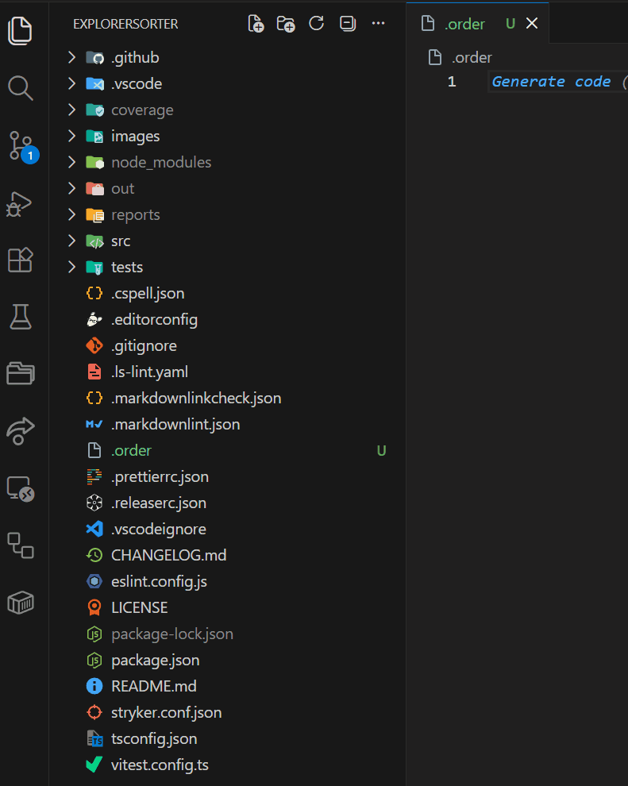

# ExplorerSorter

Manually control file and folder order in the VS Code Explorer using a simple `.order` file.

ExplorerSorter lets you define a custom file order for your workspace or project without replacing the built-in Explorer.



## Why ExplorerSorter?

VS Code does not provide a built-in way to manually define the order of files and folders in the Explorer.

ExplorerSorter solves that problem with a simple `.order` file.

- No custom tree view
- No extra sidebar
- No UI replacement
- Just the built-in Explorer in the order you want

## Features

- Uses the built-in VS Code Explorer
- Manual ordering with workspace-relative `.order` files
- Exact path rules
- Glob rules
- Recursive `.order` inheritance
- Reacts to file changes made outside VS Code
- Folders kept before files
- Lexical fallback for unmatched entries
- Works well for large workspaces and monorepos

## Install

Install from the VS Code Marketplace.

## Quick Start

Create a `.order` file in your workspace:

```text
src/index.ts
src/**/*.test.ts
README.md
```

Then let ExplorerSorter do the rest:

- it sets `explorer.sortOrder` to `modified`
- it applies your `.order` rules per directory
- it keeps unmatched entries in lexical order

## Rule Types

Exact rule

```text
src/index.ts
```

Glob rule

```text
src/**/*.test.ts
```

Comment

```text
# keep important files first
```

Rules are always workspace-relative.  
Lines starting with `#` are ignored.

## Example

Given this `.order` file:

```text
src
README.md
package.json
docs
```

ExplorerSorter prioritizes matching entries in that order while leaving unmatched files in lexical order.

## How It Works

ExplorerSorter does not replace the Explorer UI.

Instead it:

1. sets `explorer.sortOrder` to `modified`
2. reads your `.order` files
3. computes the desired order per directory
4. updates file and folder modification times to reflect that order

VS Code then displays the built-in Explorer using that computed order.

## How Ordering Works

- Rules are evaluated per directory
- For a child directory, the child `.order` file is applied first
- Parent `.order` rules are applied after the child rules
- Exact and glob matches are applied first
- Entries with no matching rule stay in lexical order
- Folders and files are sorted separately, so folders stay before files
- Ignored directories are skipped using:
  - `explorerSorter.ignoredDirectories`
  - `explorerSorter.extraIgnoredDirectories`

## Example Inheritance

If the workspace root `.order` contains:

```text
src
README.md
```

and `docs/.order` contains:

```text
guide.md
```

the merged rule order becomes:

```text
guide.md
src
README.md
```

## Settings

`explorerSorter.ignoredDirectories`  
Replace the built-in ignored directory list completely.

`explorerSorter.extraIgnoredDirectories`  
Append additional ignored directories without replacing the defaults.

## Use Cases

ExplorerSorter is useful when you want to:

- keep important files at the top of a project
- group files by how you actually navigate them
- make onboarding easier for teammates
- make large workspaces easier to scan
- keep monorepos organized

## License

Licensed under the MIT License.
